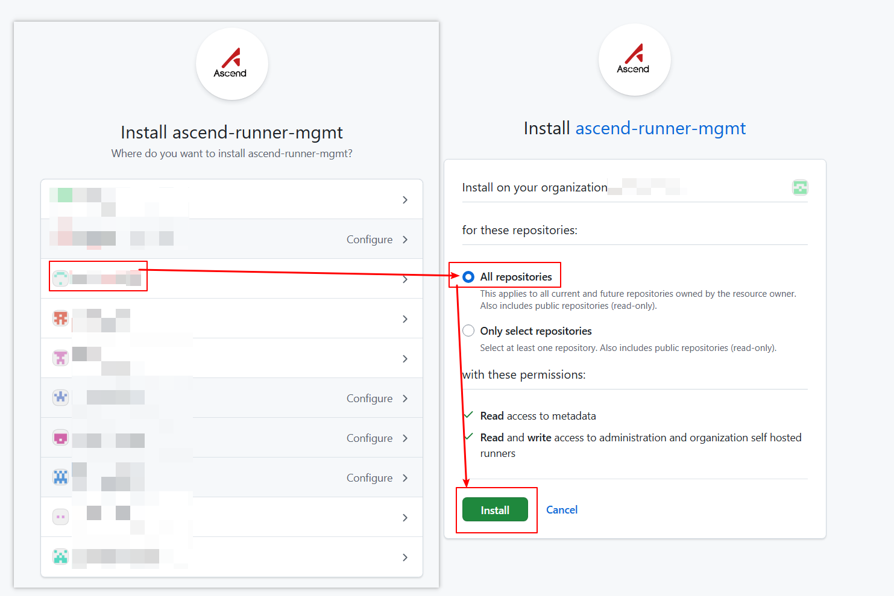
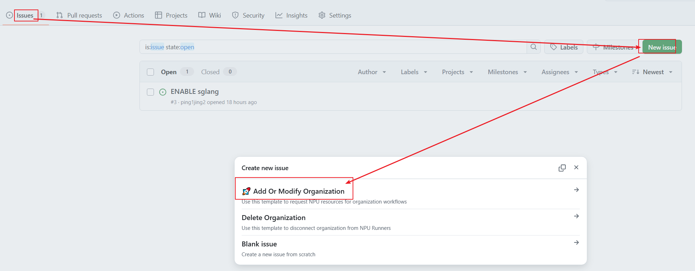
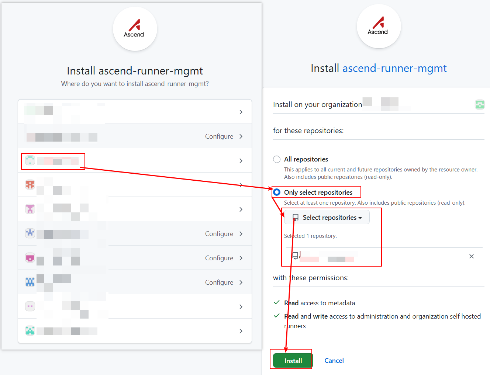
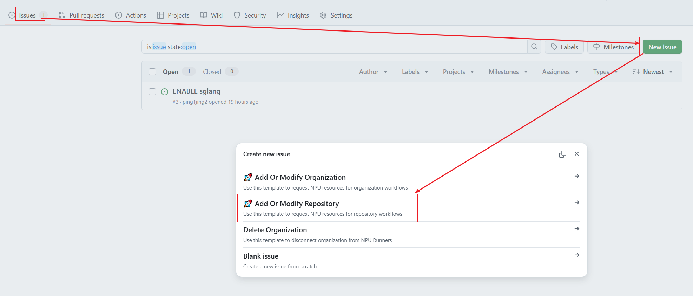
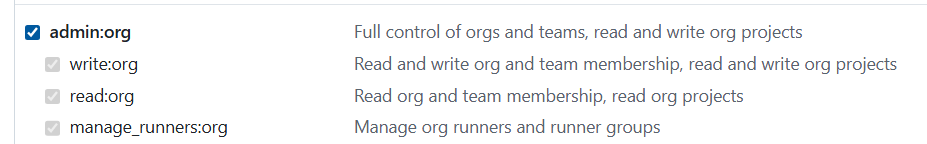
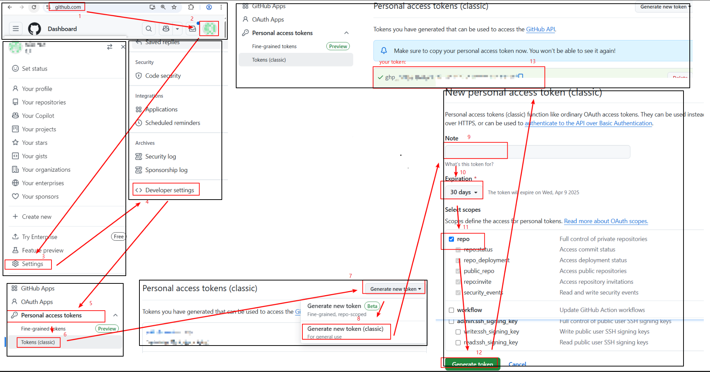
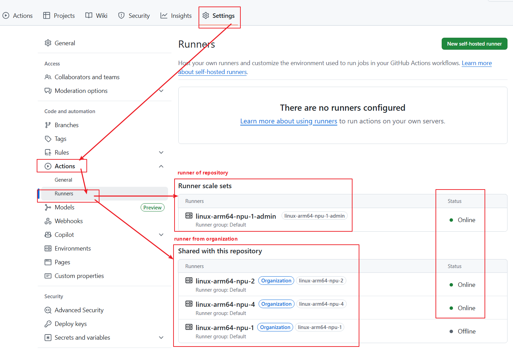

# User Manual  
We implement GitHub Action tasks on Ascend cluster nodes based on [ARC](https://github.com/actions/actions-runner-controller/).  

We introduce the installation methods based on the installation scope (organization/repository) and access permissions (GitHub App/PAT). You can choose one method for installation or combine multiple methods.  
If you encounter any issues during installation/usage, please [create a discussion](https://github.com/ascend-gha-runners/docs/discussions).  

||Organization|Repository|
|--|--|--|
|GitHub App|[Instalation Method](#install-runner-to-organization-via-github-app)|[Instalation Method](#install-runner-to-organization-via-pat)|
|PAT|[Instalation Method](#install-runner-to-organization-via-pat)|[Instalation Method](#install-runner-to-repository-via-pat)|  

---

## Install Runner to Organization via GitHub App  
### Prerequisites  
Requires administrative permissions for the organization.  

### Optional: Install Runner Group  
Runners installed at the organization level are managed by runner groups.  
Runner groups have three configuration options to control which repository workflows can use the runner:  
1. Repositories: All repositories in the organization / Specific repositories.  
2. Repository access: private / public.  
3. Workflow: All workflows / Specific workflows.  
Repositories meeting all three configurations can use the organization’s runners.  

If no runner group is specified, the `default` runner group will be used with the following configurations:  
1. Repositories: All repositories selected.  
2. Repository access: private.  
3. Workflow: All workflows selected.  

You may use and modify the `default` runner group to manage runners (skip [Create New Runner Group](https://docs.github.com/en/actions/how-tos/hosting-your-own-runners/managing-self-hosted-runners/managing-access-to-self-hosted-runners-using-groups#creating-a-self-hosted-runner-group-for-an-organization)). If the default runner group is already managing runners with permissions different from the new runners, create a custom runner group (refer to [Create New Runner Group](https://docs.github.com/en/actions/how-tos/hosting-your-own-runners/managing-self-hosted-runners/managing-access-to-self-hosted-runners-using-groups#creating-a-self-hosted-runner-group-for-an-organization)).  

### Install GitHub App  
Visit [apps/ascend-runner-mgmt][1] in your browser and click `Install`.  

Select the organization, choose `All repositories`, and click `Install`.  

### Submit Request to Activate Organization  
Visit [ascend-gha-runners/org-archive/issues][2] in your browser and click `New issue` → `Add Or Modify Organization` template.  

Fill in the three configuration parameters and click `Create`:  
- `org-name`: Your organization name.  
- `runner-group-name`: Runner group name (default: `Default`).  
- `npu-counts`: Number of NPU cards mounted on NPU Runners.  


---

## Install Runner to Repository via GitHub App  
### Prerequisites  
Requires administrative permissions for both the organization and repository.  

### Install GitHub App  
Visit [apps/ascend-runner-mgmt][1] in your browser and click `Install`.  

Select the organization, choose `Only select repositories`, select your repositories, and click `Install`.  


### Submit Request to Activate Repository  
Visit [ascend-gha-runners/org-archive/issues][2] in your browser and click `New issue` → `Add Or Modify Repository` template.  

Fill in the two configuration parameters and click `Create`:  
- `repo-name`: Your repository name.  
- `npu-counts`: Number of NPU cards mounted on NPU Runners.  


---

## Install Runner to Organization via PAT  
### Prerequisites  
Requires administrative permissions for the organization.  

### [Optional: install runner group](#optional-install-runner-group)  

### Create Token  
Create a token following [GitHub Docs](https://docs.github.com/en/authentication/keeping-your-account-and-data-secure/managing-your-personal-access-tokens#creating-a-personal-access-token-classic).  
Select `admin:org` for scopes.  
**Note**: After the token expires, the Runner scale set will disappear from the repository, and workflows will fail. Regenerate a valid token when expired.  


### Submit Request to Activate Organization  
For token security, send an email to `gouzhonglin@huawei.com`.  
**Email Subject**: `Request Ascend NPU Runners`  
**Email Content**:  
```yaml  
repo: https://github.com/my-org/  
runner_group: ascend-ci  
token: ghp_xxx  
expire-at: 30days  
npu_counts: 1, 2, 4  
```  

---

## Install Runner to Repository via PAT  
### Prerequisites  
Requires administrative permissions for the repository.  

### Create Token  
Create a token following [GitHub Docs](https://docs.github.com/en/authentication/keeping-your-account-and-data-secure/managing-your-personal-access-tokens#creating-a-personal-access-token-classic).  
Select `repo` for scopes.  
**Note**: After the token expires, the Runner scale set will disappear from the repository, and workflows will fail. Regenerate a valid token when expired.  


### Submit Request to Activate Repository  
For token security, send an email to `gouzhonglin@huawei.com`.  
**Email Subject**: `Request Ascend NPU Runners`  
**Email Content**:  
```yaml  
repo: https://github.com/my-org/my-repo  
token: ghp_xxx  
expire-at: 30days  
npu_counts: 1, 2, 4  
```  

---

## Usage  
### Runner Naming Convention  
The naming convention for runner is composed of the following parts:
```  
linux-amd64-npu-x  
^     ^     ^   ^  
|     |     |   |  
|     |     |   Number of NPUs Available  
|     |     NPU Designator  
|     Architecture  
Operating System  
```  

### View Runners  
Whether installed at the repository or organization level, runners are triggered by repository workflows. Navigate to your repository → `Settings` → `Actions` → `Runners`.  
- `Runner scale set`: Runners configured for the repository.  
- `Shared with this repository`: Organization runners accessible to the repository.  
Status `Online` indicates availability.  


### Use NPU Runners in Workflows  
To utilize Ascend NPUs in a job, specify the `container.image` field. Otherwise, NPU resources won’t be allocated to runner pod.  
**Example Workflow**:  
```yaml  
name: Test NPU Runner  
on:  
  workflow_dispatch:  
jobs:  
  job_0:  
    runs-on: linux-arm64-npu-1  
    container:  
      image: ascendai/cann:latest  
      
    steps:  
      - name: Show NPU info  
        run: |  
          npu-smi info  
```  

[1]: https://github.com/apps/ascend-runner-mgmt  
[2]: https://github.com/ascend-gha-runners/org-archive/issues