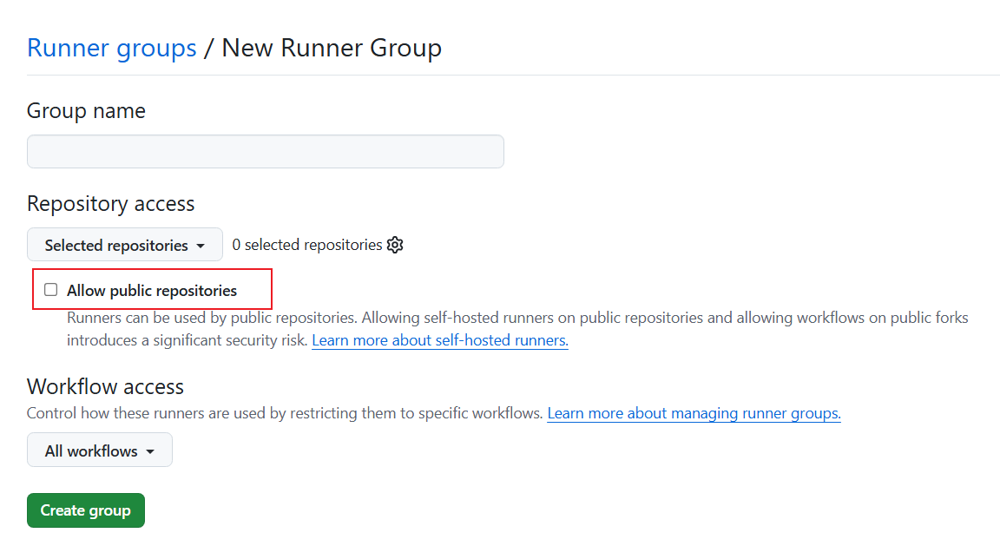
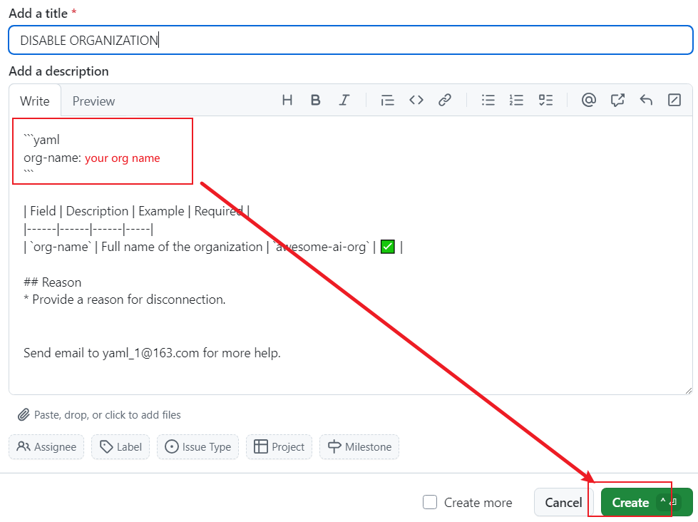
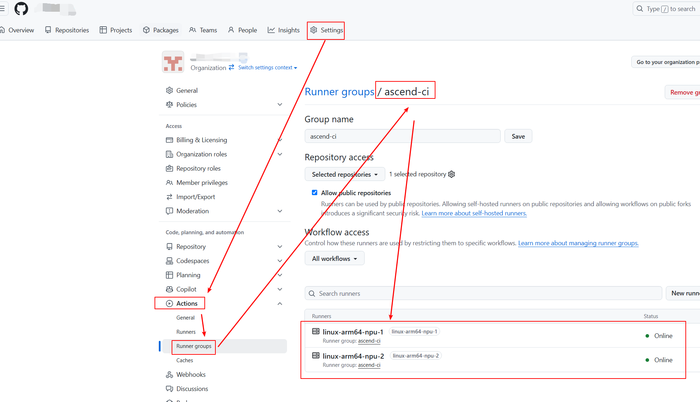

# 用户手册
本文档提供2种方法接入`NPU Runners`。
`Github App`使得同一个组织内的仓库只需配置一次即可接入`NPU Runners`，但是安装`Github App`需要联系组织管理员处理。
而`Personal access tokens (classic)`允许用户配置单个仓库，无需组织管理员同意。
## 通过 GitHub App 安装
### 准备工作
需要具备组织的管理权限.

### 安装 Github App
浏览器访问[apps/ascend-runner-mgmt][1]并且点击`Install`。

选择组织，选择仓库，点击`Install`。


### 配置Runner group
依次点击组织的`Settings`, `Actions`, `Runner groups`, `New runner group`，进入创建页面。


在新建页面配置仓库和workflow。保存`Group name`，稍后会用到。
如果想让`public`仓库接入`NPU Runners`，必须点击`Allow public repositories`。


### 提交申请激活应用
浏览器输入`https://github.com/ascend-gha-runners/org-archive/issues`，点击`New issue`选择模板。

- `Add Or Modify Organizaiton`表示新建或者更新组织配置。
- `Delete Organization`表示删除组织。


##### 添加或者修改组织
填写配置参数后点击`Create`。
`org-name`表示您的组织名称。
`runner-group-name`表示`Runner group`的名称。
`npu-counts`表示NPU Runners挂载的NPU卡数量。

##### 删除组织
填写配置参数后点击`Create`。
`org-name`表示您的组织名称。


## 通过 Personal access tokens (classic) 安装
### 准备工作
需要具备仓库的访问权限.

### 生成 token
依次点击个人账户的`Settings`, `Developer settings`, `Personal access tokens`, `Tokens (classic)`, `Generate new token`, `Generate new token (classic)`。
填写名称，选择过期时间，点击`repo`，点击`Generate token`，即生成token。

### 提交申请激活应用
考虑到token保密需求，申请方式是向`gouzhonglin@huawei.com`发送邮件。
邮件主题模板：`Request Ascend NPU Runners`
邮件内容模板：
```yaml
repo: my-org/my-repo
token: ghp_xxx
expire-at: 30days
```

## 使用
### NPU Runners命名规范
NPU Runners由以下部分组成：
```
linux-amd64-npu-x
^     ^     ^   ^
|     |     |   |
|     |     |   Number of NPUs Available
|     |     NPU Designator
|     Architecture
Operating System
```

### 查看 NPU Runners
#### 通过归档文件查看
我们在`https://github.com/ascend-gha-runners/org-archive/tree/main/org-archive/`目录维护接入NPU Runners的所有组织的最新配置状态。在`<your-org>.yaml`中查看您的组织。其中`online-runners`字段展示NPU Runners。

#### 通过Runner group查看
依次点击组织的`Settings, Actions, Runner groups`。在自己配置的runner group里就能看到runners，比如图中的`linux-arm64-npu-1, linux-arm64-npu-2`。


### 在workflow中使用NPU Runners
NPU jobs必须运行在容器中(比如：`ascendai/cann:latest`)。如果未指定容器，则job不会调用NPU资源。
以下例子展示Github Action workflow如何使用NPU Runners。
```yaml
name: Test NPU Runner
on:
  workflow_dispatch:
jobs:
  job_0:
    runs-on: linux-arm64-npu-1
    container:
      image: ascendai/cann:latest
      
    steps:
      - name: Show NPU info
        run: |
          npu-smi info
```

如果有任何问题，请[提出discussion](https://github.com/ascend-gha-runners/docs/discussions)。


[1]: https://github.com/apps/ascend-runner-mgmt