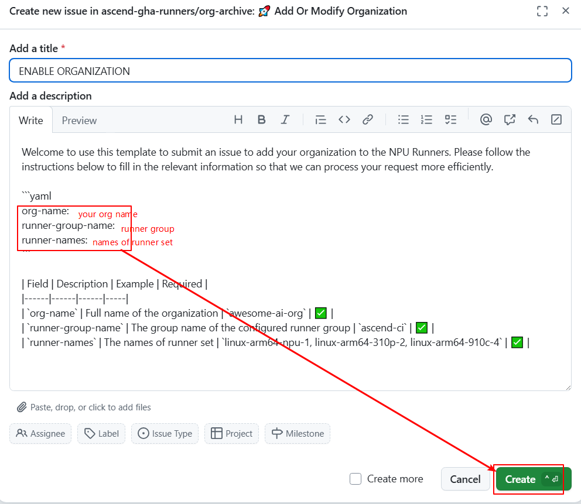
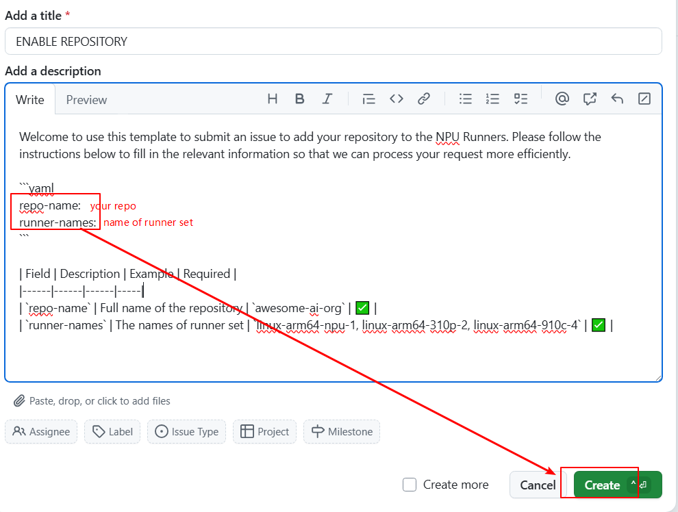

# 用户手册
我们基于[ARC](https://github.com/actions/actions-runner-controller/)实现 GitHub Action 任务在昇腾集群节点上执行。

## Runner pod 类型及命名方式
昇腾集群创建 runner pod 执行 Github Action job。
我们提供如下类型的昇腾芯片。如果您未指定名称，我们将使用默认命名。


|类型|架构|节点数|每台节点卡数|默认命名(x表示卡数)|
|--|--|--|--|--|
|310P3|arm64|1|8|linux-aarch64-310p-x|
|910C|arm64|2|16|linux-aarch64-910c-x|
|910B4|arm64|4|8|linux-arm64-npu-x|
|910B1|arm64|4|8|linux-aarch64-a2-x|

### 默认 runner pod 命名规范
Runner pod 名称由以下部分组成：
```
linux-arm64-npu-x
^     ^     ^   ^
|     |     |   |
|     |     |   Number of NPUs Available
|     |     NPU Designator
|     Architecture
Operating System
```

## 安装
我们按照安装范围(组织/仓库)和接入权限(GitHub App/PAT)分别介绍安装方式。您可以选择其中一种种方式安装，也可以搭配多种方式混合安装。
如果安装到组织，可以在仓库间复用 runner。并且可以通过 runner group 限制仓库范围。如果安装到仓库，只有单个仓库可以使用 runner。
GitHub App 权限更安全，但是需要组织管理者权限。如果觉得很难获取组织层面的许可，可以选择 PAT 权限。
如果您在安装/使用过程中有任何问题，请[提出discussion](https://github.com/ascend-gha-runners/docs/discussions)。

||组织|仓库|
|--|--|--|
|GitHub App|[安装方式](#通过-github-app-将-runner-安装到组织)|[安装方式](#通过-github-app-将-runner-安装到仓库)|
|PAT|[安装方式](#通过-pat-将-runner-安装到组织)|[安装方式](#通过-pat-将-runner-安装到仓库)|

## 通过 GitHub App 将 runner 安装到组织
### 准备工作
需要具备组织的管理权限。
### 可选：安装 runner group
被安装到组织的 runner 由 runner group 管理。
runner group 有3个配置选项以控制仓库的 workflow 是否可以使用 runner。
1. 仓库：选择组织下所有仓库 / 选择指定仓库。
2. 仓库访问权限：private / public。
3. workflow: 选择所有 workflow / 选择指定 workflow。
同时满足3个配置的仓库可以使用组织的 runner。

如果没有指定 runner group，则使用默认 runner group，其默认配置是：
1. 仓库：选择所有仓库。
2. 仓库访问权限： private。
3. workflow: 选择所有 workflow。

您可以使用并更改默认 runner group 来管理 runner，跳过[新建 runner group](#新建-runner-group)。
如果默认 runner group 已经管理 runner 并且其权限与新 runner 不同，您可以参考[新建 runner group](https://docs.github.com/en/actions/how-tos/hosting-your-own-runners/managing-self-hosted-runners/managing-access-to-self-hosted-runners-using-groups#creating-a-self-hosted-runner-group-for-an-organization)创建自定义 runner group 来管理 runner。

### 安装 GitHub App
浏览器访问[apps/ascend-runner-mgmt][1]并且点击`Install`。

选择组织，选择`All repositories`，点击`Install`。


### 提交申请激活组织
浏览器访问[ascend-gha-runners/org-archive/issues][2]并且依次点击`New issue`, `Add Or Modify Organization`选择模板。

填写3个配置参数后点击`Create`。如果您需要自定义 runner 名称，请在 issue 中说明。
`org-name`表示您的组织名称。
`runner-group-name`表示`Runner group`的名称，默认`Default`。
`runner-names`表示 Runner 的名称。


## 通过 GitHub App 将 runner 安装到仓库
### 准备工作
需要具备组织及仓库的管理权限。
### 安装 GitHub App
浏览器访问[apps/ascend-runner-mgmt][1]并且点击`Install`。

选择组织，选择`Only select repositories`，选择目标仓库，点击`Install`。

### 提交申请激活仓库
浏览器访问[ascend-gha-runners/org-archive/issues][2]并且依次点击`New issue`, `Add Or Modify Repository`选择模板。

填写2个配置参数后点击`Create`。如果您需要自定义 runner 名称，请在 issue 中说明。
`repo-name`表示您的仓库名称。
`runner-names`表示 Runner 的名称。



## 通过 PAT 将 runner 安装到组织
### 准备工作
需要具备组织的管理权限。

### [可选:安装-runner-group](#可选安装-runner-group)

### 创建 token
根据[GitHub Docs](https://docs.github.com/en/authentication/keeping-your-account-and-data-secure/managing-your-personal-access-tokens#creating-a-personal-access-token-classic)创建token。
scopes 选择`admin:org`。
请注意token到期时间，token到期之后仓库不显示 Runner scale set，无法执行 workflow，需要重新生成有效token。


### 提交申请激活组织
考虑到token保密需求，申请方式是向`gouzhonglin@huawei.com`发送邮件。如果您需要自定义 runner 名称，请在邮件中说明。
邮件主题模板：`Request Ascend NPU Runners`
邮件内容模板：
```yaml
repo: https://github.com/my-org/
runner-group: ascend-ci
token: ghp_xxx
expire-at: 30days
runner-names: linux-arm64-npu-1
```

## 通过 PAT 将 runner 安装到仓库
### 准备工作
需要具备仓库的管理权限。

### 创建 token
根据[GitHub Docs](https://docs.github.com/en/authentication/keeping-your-account-and-data-secure/managing-your-personal-access-tokens#creating-a-personal-access-token-classic)创建token。
scopes 选择`repo`。
请注意token到期时间，token到期之后仓库不显示 Runner scale set，无法执行 workflow，需要重新生成有效token。


### 提交申请激活仓库
考虑到token保密需求，申请方式是向`gouzhonglin@huawei.com`发送邮件。如果您需要自定义 runner 名称，请在邮件中说明。
邮件主题模板：`Request Ascend NPU Runners`
邮件内容模板：
```yaml
repo: https://github.com/my-org/my-repo
token: ghp_xxx
expire-at: 30days
runner-names: linux-arm64-npu-1
```

## 使用
### 查看 Runner
无论是将 runner 安装到仓库还是组织，启动 runner 的都是仓库里的workflow。进入您的仓库，依次点击组织的`Settings, Actions, Runner `。`Runner scale set`目录下是配置到仓库的 runner。`Shared with this repository`目录下是仓库可以访问的组织 runner。`Status`为`Online`表示可以使用。


### 在workflow中使用NPU Runners
如果想在 job 中使用昇腾芯片，需要指定`container.image`字段，否则job不会调用NPU资源。
以下例子展示Github Action workflow如何使用NPU Runners。
```yaml
name: Test NPU Runner
on:
  workflow_dispatch:
jobs:
  job_0:
    runs-on: linux-arm64-npu-1
    container:
      image: ascendai/cann:latest
      
    steps:
      - name: Show NPU info
        run: |
          npu-smi info
```

[1]: https://github.com/apps/ascend-runner-mgmt
[2]: https://github.com/ascend-gha-runners/org-archive/issues
